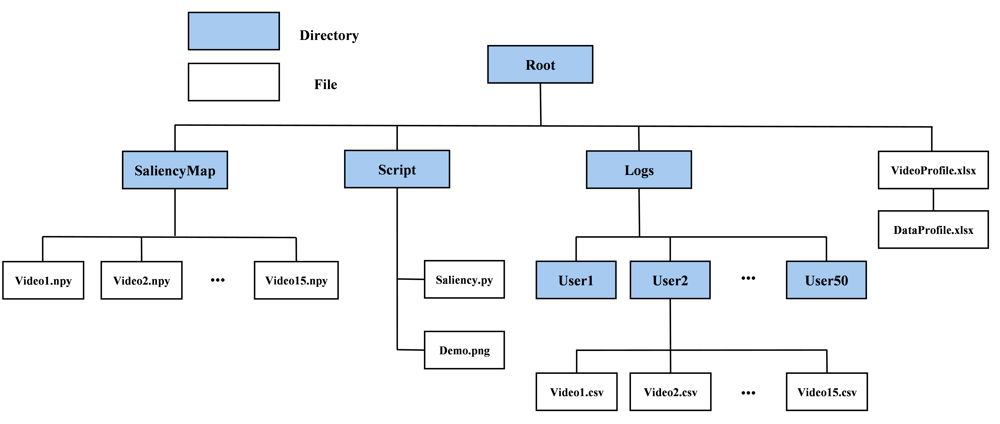

# Panonut360

## About
We present the Panonut360 dataset of 50 users (25 males and 25 females) recorded while they were watching panoramic videos using the HTC VIVE Pro HMD. The dataset contains over 60 hours of data collected at 120Hz which combines multidimensional information. We believe the dataset can provide resource for exploring user behavior in panoramic videos. The dataset will hopefully enable researchers to develop adaptive streaming systems for panoramic videos.

## Download
You can download the [dataset](https://drive.google.com/drive/folders/1g85yjNeFpTD_R6mMyQk9hy7oQrWaRiE_)  and the [videos](https://drive.google.com/drive/folders/1Nmi7QxqnQ7srXQXIQxdYWd1PV72-WMHm) from the link easily.

## File tree

This figure shows the file tree of the dataset. In *VideoProfile*, we provide more information about the videos; in *DataProfile*, we provide the column index descriptions for the user's head and eye tracking datasets.

## Usage Demo
You can generate some saliency maps based on the field of view (FoV) fixation by this script:

```python
python ./Script/Saliency.py
```

